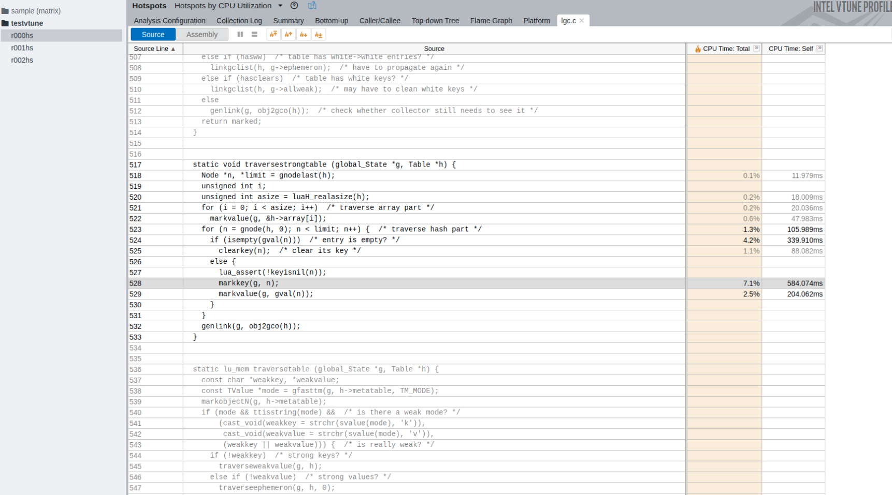

# Note
杂记

这里记录一些编程过程中的随想，趣事，以及一些好用的工具


## C++

### 多次调用setlocale，导致内存检测时，存在大量未释放内存
起因是在查看内存泄漏问题时，看到古老的代码中存在内存问题，于是使用intel vtune定位问题，发现`setlocale(LC_ALL, "");`语句存在大量内存未释放。

```cpp
std::wstring NarrowToWide( const std::string &source )
{
	int len = source.length() + 1;
	auto buf = array_ptr_wchar(new wchar_t[len]);
	zeroMemory( buf.get(), (source.length() + 1) * sizeof(short) );
#ifdef _WIN32
	MultiByteToWideChar(CP_ACP, 0, source.c_str(), (int)source.length(), buf.get(), (int)(source.length()) * sizeof(short) );
#elif __linux__
	setlocale(LC_ALL, "");
	mbstowcs(buf.get(), source.c_str(), len);
#endif
	return( buf.get() );
}
```

原理：  

函数NarrowToWide是个工具函数在程序多处调用，导致大量内存未释放。

然而明显这是个底层系统调用，因此选择查阅阅读文档，看看有没有说明，发现返回值将被存储在static storage上。 因此理论上来说setlocale应当只在初始化时调用一回即可。
A successful call to setlocale() returns an opaque string that
corresponds to the locale set.  This string may be allocated in
static storage. 

解决：  
讲工具函数内的setlocale删除掉，在程序初始化时设定setlocale


## Lua

### 为什么在早期的库里面 在luaL_openlibs之前要关闭gc
问题：  
最开始是在别人的代码中发现的这段逻辑  
这段gc看起来很高深莫测，似乎看不出道理来  
```
  lua_gc(L, LUA_GCSTOP, 0);  /* stop collector during initialization */
  luaL_openlibs(L);  /* open libraries */
  lua_gc(L, LUA_GCRESTART, 0);
```

原理：  

在搜索中发现最早的[lua5.1版本源码](https://github.com/lua/lua/blob/69ea087dff1daba25a2000dfb8f1883c17545b7a/lua.c#L332)中的就存在这段写法，
我们看到在luaL_openlibs之前强行关闭了gc，并在openlibs结束后开启  

关于这么做的用意，Roberto回答是[to reduce the GC overhead when creating large number of
objects that are not garbage](http://lua-users.org/lists/lua-l/2008-07/msg00690.html)
即在创建大量不需要垃圾回收对象时减少额外开销


结论：  
5.1和5.2是需要关掉gc的  
5.3开始已经没有类似的写法了

我们查看了我们正在使用的最新的lua5.4版本的源码，发现已经没有再使用类似的调用了，因此我们就不再沿用老的写法了


### Lua 源码中 l_likely, l_unlikey 是什么意思
问题:  
最近在排查c++程序内部调用lua_pcall时产生`C stack overflow`异常，
问题时发现lua源码中存在一些likely调用  


lua代码：
```c
// 校验c层的nCcalls调用计数
// getCcalls函数返回lua层调用c层回调call的计数值
// LUAI_MAXCCALLS 是调用限制的宏定义 5.4中定义为200
// 即如果调用超过200时 调用luaE_checkcstack 引发异常
if (l_unlikely(getCcalls(L) >= LUAI_MAXCCALLS))
    luaE_checkcstack(L);

//////////////////////////////////////
#define l_likely(x)	luai_likely(x)
#define l_unlikely(x)	luai_unlikely(x)


/*
** macros to improve jump prediction, used mostly for error handling
** and debug facilities. (Some macros in the Lua API use these macros.
** Define LUA_NOBUILTIN if you do not want '__builtin_expect' in your
** code.)
*/
#if !defined(luai_likely)

#if defined(__GNUC__) && !defined(LUA_NOBUILTIN)
#define luai_likely(x)		(__builtin_expect(((x) != 0), 1))
#define luai_unlikely(x)	(__builtin_expect(((x) != 0), 0))
#else
#define luai_likely(x)		(x)
#define luai_unlikely(x)	(x)
#endif

#endif

```  
好，直到这里我们发现这是一个编译时的宏定义，甚至在某些特定情况下l_likely和l_unlikely调用了和没调用没区别  
即不论`if (l_likely(r))`还是`if (l_unlikely(r))` 在逻辑语义上是完全等价于`if (r) ` 


#### 那么，什么是__builtin_expect ?  
```
Built-in Function: long __builtin_expect (long EXP, long C)
You may use `__builtin_expect' to provide the compiler with branch prediction information.
The return value is the value of EXP, which should be an integral  expression.  The value of C must be a compile-time constant.  The semantics of the built-in are that it is expected that EXP == C.

For example:
    if (__builtin_expect (x, 0))
        foo ();

would indicate that we do not expect to call `foo', since we expect `x' to be zero.  Since you are limited to integral expressions for EXP, you should use constructions such as
    if (__builtin_expect (ptr != NULL, 1))
        error ();
when testing pointer or floating-point values.
```
乍一看满头问号，预测信息？ 不对啊，只有我写代码才是玄学才对啊（不是  


其实是这样的，这个函数是gcc提供的为编译优化处理的函数，并不会对逻辑语义造成影响  
例如:
```
if (l_ulikely(<绝大多数情况都不会为真>)) {
    // do if
} else {
    // do else
}
```
上述语句中，在gcc(>=2.96)编译的情况下，编译器将会把else部分的逻辑进行编译优化，以期待减少指令跳转带来的性能损耗  
那么具体优化了啥呢？  
现在处理器都是流水线的，有些里面有多个逻辑运算单元，系统可以提前取多条指令进行并行处理，但遇到跳转时，则需要重新取指令，这相对于不用重新去指令就降低了速度。  
目的是增加条件分支预测的准确性，cpu会提前装载后面的指令，遇到条件转移指令时会提前预测并装载某个分支的指令。unlikely 表示你可以确认该条件是极少发生的，相反 likely 表示该条件多数情况下会发生。编译器会产生相应的代码来优化 cpu 执行效率。  

#### 总结  
不论`if (l_likely(r))`还是`if (l_unlikely(r))` 在逻辑语义上是完全等价于`if (r) `  
我们可能会在大多数地方找到不一样名字关于likely/unlikely的宏定义，  
函数本质上是为了编译时优化逻辑跳转减少重新取指令的开销，并不会影响实际的逻辑语义  

因此，在你十分确信绝大多数情况下为真时使用likely,或者在你十分确信绝大多数情况下为假时使用unlikely.  
例如问题最开始的`if (l_unlikely(getCcalls(L) >= LUAI_MAXCCALLS))`, 因为正常情况下不可能引发`C Stack Overflow`的异常  


## Linux

### VNC 

ubuntu 20.04中已经将vino嵌入系统中，在settings-Sharing-点击上方的开关，点击Screen Sharing的开关根据提示设置密码或者不设置即可

如果通过其他非linux vnc客户端链接时，例如通过vnc viewer链接 ubuntu的ip:5900端口会提示 `Unable to connect to VNC Server using your chosen security settting.`  
此时还需要输入一下命令解决
`$ gsettings set org.gnome.Vino require-encryption false` 注意在你开启vnc server的用户下执行该命令

[参考](https://www.answertopia.com/ubuntu/ubuntu-remote-desktop-access-with-vino/)


### nfs server关闭导致异常
问题：
依赖nfs的服务如果nfs服务异常会引发一系列的异常，下面例举一些工作中遇到的情况
- `df -h` 命令卡顿长时间没有反馈
- 挂载了nfs路径的docker服务器restart长时间无效果，或者卡在Created阶段
- 挂载了nfs路径的docker服务器 无法关闭

原理：


结论：
先判断本机是否有mount过nfs的目录, 通过mount命令判断已经挂载的目录    
```bash
$ sudo mount -l -t nfs4
172.18.0.200:/games/internal on /games type nfs4 (rw,relatime,vers=4.0,rsize=524288,wsize=524288,namlen=255,hard,proto=tcp,timeo=600,retrans=2,sec=sys,clientaddr=172.22.156.55,local_lock=none,addr=172.18.0.200)

# 查看挂载的目录内容有没有
$ ls -l /games

# 通过umount命令， 将有问题的目录umount
$ sudo umount /games
```

## DB

### MongoDB 如何设置分片键  

如何为一个分片集数据库设置片键  
首先链接db，注意需要使用root权限的账号链接  
`sh.status()`检查数据库是否支持分片以及各分片状态,如果报错`not authorized on config to execute command`,则需要进一步确认账号，是否拥有root权限  
使用命令`sh.getBalancerState()`确认balancer开启    

首先开启指定db的分片功能，`sh.enableSharding("<dbName>")`;  
查看collection分片状态
```
> use <dbName>; 
> db.getCollection('<collectionName>').getShardDistribution();
```
为collectin设置分片键，
```
> sh.shardCollection("<dbName>.<collectionName>", {"_id":"hashed" 或者 1})
```

1代表 range-based sharding, 即会按shardKey的值划分连续的范围进行存储
hashed代表 hashed sharding， hashed则会将shardKey进行hash后散列存储在各个chuck内  


这里可能会报错`Please create an index that starts with the proposed shard key before sharding the collection`,此时需要对相应的key设置index`db.getCollection('<collectionName>').createIndex({_id:"hashed"})` 注意这里的index设置需要和你上面分片的类型一样，上面写range-base这里也要是一样的  


再次检查分片状态
```
mongos> db.getCollection('<collectionName>').getShardDistribution()

Shard shard2 at shard2/mongodb1:27020,mongodb2:27020,mongodb3:27020
 data : 19.96MiB docs : 645 chunks : 1
 estimated data per chunk : 19.96MiB
 estimated docs per chunk : 645

Totals
 data : 19.96MiB docs : 645 chunks : 1
 Shard shard2 contains 100% data, 100% docs in cluster, avg obj size on shard : 31KiB
```
到此分片就设置完了
注意:默认情况下chunk size为64M因此可能会出现设置完后，数据依旧全部存储在一个shard上的情况


[如何合理的设置分片键](https://docs.mongodb.com/manual/core/sharding-choose-a-shard-key/)  


## Debug

### Core dump （核心转储）
core dump是程序运行时，在进程收到某些信号而终止运行时，将此时进程地址空间的内容以及有关进程状态的其他信息写入一个磁盘文件。

对应会产生core dump的信号
| Signal  | Action | Comment                  |
|---------|--------|--------------------------|
| SIGQUIT | Core   | Quit from keyboard       |
| SIGILL  | Core   | Illegal Instruction      |
| SIGABRT | Core   | Abort signal from abort  |
| SIGSEGV | Core   | Invalid memory reference |
| SIGTRAP | Core   | Trace/breakpoint trap    |

我们可以通过使用gdb查core dump文件，最后崩溃时的信息，来进行debug  
为了更好的查看阅读core dump文件, linux下需要进行以下配置


#### 设置core文件生成位置， 默认为当前目录
可以修改/proc/sys/kernel/core_pattern，将core文件生成到指定目录下
```
mkdir /cores
echo "/cores/core.%t.%e.%p" | sudo tee /proc/sys/kernel/core_pattern
```
参数包含
```
%e  Executable name
%h  Hostname
%p  PID of dumped process
%s  Signal causing dump
%t  Time of dump
%u  UID
%g  GID
```

####  设置系统ulimit core size
可以通过`ulimit -c` 查看当前 core size， 默认为0，即不会生成core dump文件

- 通过`ulimit -c unlimited`设置当前会话中的ulimit， 退出或者新开会话会失效
- 为docker 设置ulimit， 默认会跟随 dockerd的配置，也可以在运行时指定 `docker run --ulimit core=-1 --security-opt seccomp=unconfined -v /cores:/cores <后续命令>`
- 在程序中直接设定，下面是一个例子

```cpp
#include <unistd.h>
#include <sys/time.h>
#include <sys/resource.h>
#include <stdio.h>
#define CORE_SIZE   -1
int main()
{
    struct rlimit rlmt;
    if (getrlimit(RLIMIT_CORE, &rlmt) == -1) {
        return -1; 
    }   
    printf("Before set rlimit CORE dump current is:%d, max is:%d\n", (int)rlmt.rlim_cur, (int)rlmt.rlim_max);

    rlmt.rlim_cur = (rlim_t)CORE_SIZE;
    rlmt.rlim_max  = (rlim_t)CORE_SIZE;

#if DEBUG
    // 主要是这句 设定 core size
    if (setrlimit(RLIMIT_CORE, &rlmt) == -1) {
        return -1; 
    }   
#endif

    if (getrlimit(RLIMIT_CORE, &rlmt) == -1) {
        return -1; 
    }   
    printf("After set rlimit CORE dump current is:%d, max is:%d\n", (int)rlmt.rlim_cur, (int)rlmt.rlim_max);

    /*测试非法内存，产生core文件*/
    int *ptr = NULL;
    *ptr = 10; 

    return 0;
}
```
由于我们大多数工程测试时都是跑在clion+wsl环境中的， 当clion启动wsl时会通过 wsl另外启动一个sh的壳导致我们在系统内部设置的ulimit失效，所以我们项目中选择在程序内设定。 通过`C:\Windows\system32\wsl.exe --distribution Ubuntu-18.04 --exec /bin/sh -c "ulimit -c"`可以验证  


#### 添加编译参数，在查看core dump文件时可以拿到更详细的信息
```
CMakeLists.txt
        add_definitions(-DDEBUG=true)
        add_definitions(-DRELEASE=false)

        # core dump config
        add_definitions("$ENV{CXXFLAGS} -O0 -g")
        SET(CMAKE_CXX_FLAGS_DEBUG "$ENV{CXXFLAGS} -O0 -g")
```

#### 至此 当程序异常退出时，我们可以在debug环境下愉快的拿到core文件了

假设core文件为`/cores/core.1630405848.pixelpai.19`,我们就可以通过gdb解析对应的文件    
bt # 获取最后退出堆栈的详细信息  
frame 3 # 简写 f 3 切到第3个frame 并输出相关代码  
p value # 展示所在帧value对象的值  
up # 移到上一个帧  
down # 移到下一个帧  

```
gdb main /cores/core.1630405848.pixelpai.19
...
GNU gdb (Ubuntu 8.1.1-0ubuntu1) 8.1.1
Copyright (C) 2018 Free Software Foundation, Inc.
License GPLv3+: GNU GPL version 3 or later <http://gnu.org/licenses/gpl.html>
This is free software: you are free to change and redistribute it.
There is NO WARRANTY, to the extent permitted by law.  Type "show copying"
and "show warranty" for details.
This GDB was configured as "x86_64-linux-gnu".
Type "show configuration" for configuration details.
For bug reporting instructions, please see:
<http://www.gnu.org/software/gdb/bugs/>.
Find the GDB manual and other documentation resources online at:
<http://www.gnu.org/software/gdb/documentation/>.
For help, type "help".
Type "apropos word" to search for commands related to "word"...
Reading symbols from cmake-build-debug/build/bin/main...done.
[New LWP 17765]
[New LWP 2336]
[New LWP 29510]
[New LWP 11379]
[New LWP 2335]
[New LWP 2334]
[New LWP 20475]
[New LWP 20476]
[New LWP 20477]

warning: Could not load shared library symbols for 2 libraries, e.g. ./cjson.so.
Use the "info sharedlibrary" command to see the complete listing.
Do you need "set solib-search-path" or "set sysroot"?
[Thread debugging using libthread_db enabled]
Using host libthread_db library "/lib/x86_64-linux-gnu/libthread_db.so.1".
Core was generated by `/home/never/work/pixelpai_server/cmake-build-debug/build/bin/main -props /home/'.
Program terminated with signal SIGABRT, Aborted.
#0  raise (sig=<optimized out>) at ../sysdeps/unix/sysv/linux/raise.c:50
50      ../sysdeps/unix/sysv/linux/raise.c: No such file or directory.
[Current thread is 1 (Thread 0x7fca28917700 (LWP 17765))]
(gdb) bt
#0  raise (sig=<optimized out>) at ../sysdeps/unix/sysv/linux/raise.c:50
#1  0x0000562abaf64e47 in console::handler (sig=11) at /home/never/work/pixelpai_server/src/server/main/console_linux.cpp:244
#2  <signal handler called>
#3  0x00007fca316e0108 in Sprite::getSpriteSerialize (this=0x7fca00a66d00) at /home/never/work/pixelpai_server/src/server/world/virtualworld/scene/sprite.cpp:595
#4  0x00007fca3169a87a in Scene::sendEnterSceneToAll (this=0x7fca0217ba60, actorId=1685436067) at /home/never/work/pixelpai_server/src/server/world/virtualworld/scene/scene.cpp:535
...
(gdb) frame 3
#3  0x00007fca316e0108 in Sprite::getSpriteSerialize (this=0x7fca00a66d00) at /home/never/work/pixelpai_server/src/server/world/virtualworld/scene/sprite.cpp:595
(gdb) p animationSptr
$1 = std::shared_ptr<IAnimation> (empty) = {get() = 0x0}
(gdb) p spriteSptr
$2 = std::shared_ptr<op_client::Sprite> (use count 1, weak count 0) = {get() = 0x7fca0d84cea0}
(gdb) up
#4  0x00007fca3169a87a in Scene::sendEnterSceneToAll (this=0x7fca0217ba60, actorId=1685436067) at /home/never/work/pixelpai_server/src/server/world/virtualworld/scene/scene.cpp:535
535         auto characterProto = pCharacter->getSpriteSerialize();
(gdb) down
#3  0x00007fca316e0108 in Sprite::getSpriteSerialize (this=0x7fca00a66d00) at /home/never/work/pixelpai_server/src/server/world/virtualworld/scene/sprite.cpp:595

```

#### 参考
https://ctring.github.io/blog/2021/how-to-get-core-dump-in-a-Docker-container/  
https://le.qun.ch/en/blog/core-dump-file-in-docker/  
https://zhuanlan.zhihu.com/p/24311785  
https://www.cnblogs.com/hazir/p/linxu_core_dump.html


## 性能分析  

### Linux Performance


### Strace
Strace是Linux环境下用于调试诊断应用程序调用systemcall的工具。

由于Strace只检测系统调用，因此Strace只是一个分析的侧面。  
例如：命令`perl -e 'while(1){}'`不会产生任何系统调用

系统调用包括以下几个方面file, process, network, signal, ipc, desc， 默认将检测所有系统调用即all

#### 使用Strace统计运行期间系统调用占比
```
$ sudo strace -f -c main
strace: Process 30879 detached
% time     seconds  usecs/call     calls    errors syscall
------ ----------- ----------- --------- --------- ----------------
 64.79    2.184606       35236        62         3 futex
 28.13    0.948503         566      1675         1 clock_nanosleep
  2.85    0.096019           8     12105           getsockopt
  1.35    0.045417           3     16768           mprotect
  0.82    0.027561           7      4002      3633 recvfrom
  0.65    0.021963           3      7108           lseek
 ...
------ ----------- ----------- --------- --------- ----------------
100.00    3.371847                 55680      5957 total
```

#### 使用Strace 记录程序运行期间的系统调用   
可以通过添加-tt记录调用时间戳，与程序日志对比可区分出程序各个阶段的系统调用  

 

```
$ sudo strace -f -tt -T -o /tmp/test/trace.log main

$ cat /tmp/test/trace.log
18721 21:02:31.936942 execve("/bin/bash", ["bash", "-c", "APOWO_SERVER_ROOT=/home/never/wo"...], 0x7ffef5c46408 /* 14 vars */) = 0 <0.000077>
18721 21:02:31.937082 brk(NULL)         = 0x563070e9c000 <0.000017>
18721 21:02:31.937133 arch_prctl(0x3001 /* ARCH_??? */, 0x7ffe20222180) = -1 EINVAL (Invalid argument) <0.000017>
18721 21:02:31.937183 access("/etc/ld.so.preload", R_OK) = -1 ENOENT (No such file or directory) <0.000019>


PID  调用时间 系统调用名称 返回 消耗时间  
18721 21:02:31.936942 execve("/bin/bash", ["bash", "-c", "APOWO_SERVER_ROOT=/home/never/wo"...], 0x7ffef5c46408 /* 14 vars */) = 0 <0.000077> 
```

#### 参考
https://linux.die.net/man/1/strace


### Perf
首先我们需要大致理解一下Perf的原理：  
每隔一个固定的时间，就在CPU上（每个核上都有）产生一个中断，在中断上看看，当前是哪个pid，哪个函数，然后给对应的pid和函数加一个统计值，这样，我们就知道CPU有百分几的时间在某个pid，或者某个函数上了


即本质上是一种采样的模式，我们预期，运行时间越多的函数，被时钟中断击中的机会越大，从而推测，那个函数（或者pid等）的CPU占用率就越高。
`即得到的结果有时并不能完全依赖，往往需要根据实际业务做进一步分析。`

关于perf有很多命令，今天先举例`perf top`的使用

perf top -p <pid>

图中可以看到在lua中traversestrongtable调用的最多，即可得知 卡顿主要问题出现在lua层对象在一个forloop内进行了比较密集的运算导致cpu持续占用，之后的就需要进一步查看业务代码了


### Intel VTune Profiler
Intel VTune Profiler 以下简称Vtune,是intel推出的一款用于应用性能分析的一款软件工具集，是的区别于普通的分析软件，它其实一系列分析工具的集合。支持windows，linux，macos等系统，以及c/c++, Java, go, .Net, python等多种语言。
其内部还有多种分析维度


#### 安装 
按照[官方文档](https://www.intel.com/content/www/us/en/developer/tools/oneapi/vtune-profiler-download.html)安装即可   
以下简述 ubuntu安装过程  
下载对应的离线安装shell脚本，（当然也可以按apt安装），
`wget https://registrationcenter-download.intel.com/akdlm/irc_nas/18267/l_oneapi_vtune_p_2021.8.0.533_offline.sh` 此处部分同学有科学上网软件的话，可能浏览器下载比wget快。

下载完成后执行`sudo bash l_oneapi_vtune_p_2021.8.0.533_offline.sh`即开始安装  

安装完成后,还需要根据[文档](https://www.intel.com/content/www/us/en/develop/documentation/get-started-with-vtune/top/linux-os.html)执行`source /opt/intel/oneapi/vtune/latest/env/vars.sh`,即可通过vtune-gui打开vtune了， 最好将该命令写入 ~/.bashrc内


#### Hotspots
是用于分析cpu占用时间最多的调用，可以通过各种图形化gui的分析过滤方式查看cpu比较高的时刻函数占用情况。  

依旧是经典的旁路采样分析模式的采样数据， 配置完应用程序以及环境变量后，当你按下执行后，程序会开始启动，按下stop则开始分析采样数据生成各种图表。

其中的Bottom-up, Top-down Tree, Flame Graph 图表,其实都是同一组数据在不同纬度以及不同图表展示下的结果，因此可以统一对下方条件过滤处，进行时间，线程，动态库等条件过滤达到自己想查看的某些时刻或者某些部分的cpu占用比，这个很实用。

由于图表会涉及很多业务数据 因此只将外部启动的主程序图表做一个展示，

  
外部启动程序其实会根据配置载入不同的动态库实现不同功能因此主要都是系统库dlopen的占用,暂时不准备对这部分做优化，而且此处占用也只会在服务器起来的时候占用一次，因此本次暂时不优化该部分。

我们甚至可以通过双击对应想要查看的函数，获得函数每行语句的cpu时间占比。  



## 游戏编程

### 关于同步的二三事

> 定义
通常来说的状态同步，即狭义上的状态同步，即在状态发生变化时将变动的数据同步给客户端  
所谓帧同步其实是指以一帧数据为单位进行同步，但是通常来说我们认为的帧同步是 锁定帧同步（或者变种）  
那么广义上来说，其实存在既是帧同步又是状态同步，即以帧为单位的状态同步  


#### 帧同步

> 帧同步基础共识  

1. 实现目标  
A状态 + N个操作 = 确定的B状态  

2. 同步频率
看到的一些同步频率都比较高20~50次每秒，即20ms~50ms  
本地测试例子时 同步频率超过100ms就能明显的感觉到操作卡顿的感觉  

3. 什么是锁定帧  
客户端将每帧执行的行为发送给服务端，服务端在每个步进结束时广播当前帧发生的变动，客户端演绎当前帧的变化  
标准定义下，服务端在未收集到当前帧所有客户端的上报前是不会发送当前帧同步的，即所有客户端需要等最慢的返回，才能获取返回  

改进乐观锁: 
固定服务端的帧频，每个固定间隔将收到的客户端行为发送给客户端，并不确保收齐所有客户端当前帧的包，  
优点: 避免因为最慢的客户端导致全局卡顿  
缺点: 需要预测行为确保操作流畅，需要回滚修复预测偏差  


4. 预测帧尽量使得用户操作平滑 
通过对接收数据进行buffer缓存，按帧滑动并根据延迟缩放执行窗口和执行间隔达到平滑效果  
对于异常、回退帧添加插值帧，例如通过算法预测线性趋势下运行轨迹   


5. 帧回滚快进，消弭预测帧不正确导致的逻辑异常
帧回滚是如何实现的，或者说帧切片如何保存现场并恢复，注意这里说的帧切片是逻辑帧而不是渲染帧  
如何校验是否一致，通用做法是将逻辑帧切片md5后发送到服务器，服务器进行广播


`扩展思考：市面上多人游戏中，真的存在A物件运动会影响到10个以上其他物件运动的例子嘛？即在物理引擎展示中的子弹撞击方块山时的情景。如果存在是如何保存恢复逻辑帧的`

6. 为什么大多数都是UDP，而不是TCP
多数例子都是通过udp传输的，通过业务帧序列号保证前端能感知到丢包，并且额外发包降低丢包率（例如每n帧有一帧关键帧，关键帧内包含1~n帧的内容）  
不过[王者荣耀第一个测试版本](https://zentia.github.io/2019/04/22/frame-sync/)也是tcp的，所以目前来说先用tcp先上  
>那么为什么不是tcp呢？  
6.1.1 tcp通信本身在网络层存在拥塞控制，在网络状况不好的情况下会导致延迟稍大的情况引发更大的雪崩效应(可以通过切换拥塞算法或者修改TCP_NODELAY缓解，但是无法彻底避免)    
6.1.2. tcp本身时最求完全可靠和顺序性的，因此，丢包后会持续重传直至该包被确认，否则后续包也不会被上层接收，且重传采用指数避让策略，决定重传时间间隔的RTO (Retransmission Timeout)不可控制，Linux内核实现中最低值为200ms

>可能存在的一些TCP优化方案：  
6.2.1. 切换拥塞算法bbr或者修改TCP_NODELAY
6.2.2. 基于UDP定制传输层协议，引入顺序性和适当程度或者可调节程度的可靠性，修改流控算法。适当放弃重传，如：设置最大重传次数，即使重传失败，也不需要重新建立连接。比较知名的TCP加速开源方案有：quic、enet、kcp、udt。其中，quic是源自google的TCP替代方案，其主要目的是为了整合TCP协议的可靠性和UDP协议的速度和效率，其主要特性包括：避免前序包阻塞、减少数据包、向前纠错、会话重启和并行下载等，然而QUIC对标的是TCP+TLS+SPDY，相比其他方案更重，目前国内用于网络游戏较少。kcp的作者是国内优秀开发者，社区也发展良好，kcp的作者和社区开发者对enet、kcp、udt做了性能测试，详情可参见：https://github.com/skywind3000/kcp/wiki/KCP-Benchmark， 从测试情况可以看到，kcp表现不错，其次是enet，表现最差的是udt。


7. 实现一个帧同步游戏我们需要什么  
> 物理引擎至少需要满足以下两点
根据冲量驱动对象移动
碰撞分离，两个对象重叠后如何根据冲量，位置，时间信息计算出不重叠时的位置

> 定点数运算，即一个数值稳定的物理引擎

> 拥有一个稳定的tick驱动物理引擎

> 增加udp通信 不是所有情况下udp都是通的，只有在udp连上的时候采用udp 因此传统做法都是先建立tcp

> 伪随机数

> 提高同步频率，尽量不要低于物理引擎渲染帧的3倍

同步逻辑参考：
- https://zentia.github.io/2019/04/22/frame-sync/
- http://clintonbrennan.com/2013/12/lockstep-implementation-in-unity3d/
- https://www.daimajiaoliu.com/daima/56b2d86c9ab0001
- https://blog.codingnow.com/2018/08/lockstep.html
- https://zhuanlan.zhihu.com/p/344600774
- http://www.vvbin.com/?p=860